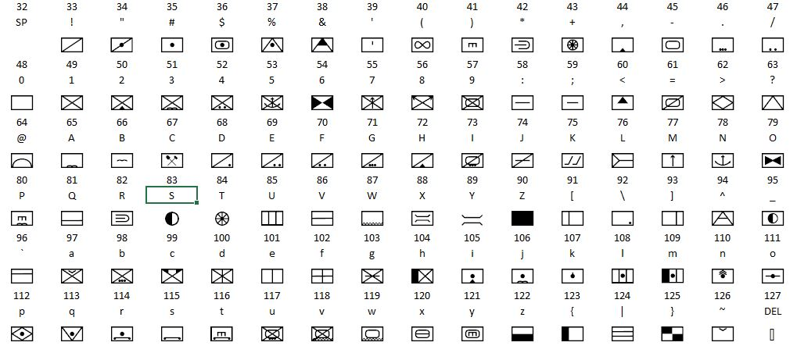
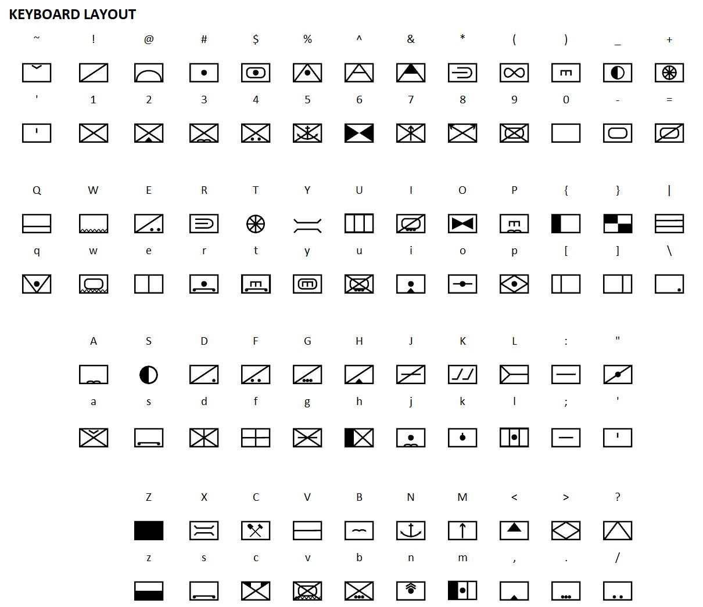

# JZNATO Symbol Font v11 readme.md

NATO symbols are widely used in wargaming. This set is intended to cover the symbols required for vintage 1970s and 1980s games from SPI, GDW and contemporaries. These symbols are all original work, and can be freely shared and used, except for commercial purposes (see below).

The font is designed to have the most used symbols on the 0-9 and shift/0-9 characters (keyboard top row). a-z and A-Z are mainly laid out in 'groups' of symbol types, infantry, artillery, cavalry etc. There are then some sundry characters. All symbols are in bounding boxes, and this version is in 3x2 (or 600x400) ratio. (further updates will be provided for 4x3 and maybe rarely used 5x3 ratio).
Modifiers (overlays) are also provided - eg parachute canopy, mountain - these can be overlaid on 'basic' symbols if required to create new combinations. 1/2 and 1/3 vertical lines are also provided. The only symbols provided without bounding boxes are supply, transport and bridge. I have limited the font to characters 33-127 to make it easy to use in all apps without opening Character Map.

These symbols are broadly based on the NATO app6c specification. You can read the whole spec at https://www.awl.edu.pl/images/en/APP_6_C.pdf or you can make your own graphics at (the excellent) https://spatialillusions.com/unitgenerator/.

There is a brilliant font set from Tom Mouat at http://www.mapsymbs.com/app-6a.html, but this is an (old) TrueType font, and I could not get it to work in Inkscape, so I DIY.

## Making Sausages
This font was created in Adobe Illustrator using 600x400px boxes and 33px stroke lines. The SVG files will be available soon here. The font was created using the simple and powerful addin FontSelf Maker https://www.fontself.com/, which is a very reasonable $39 at the time of writing.

## Copyleft
This font is free to use and share under the Creative Commons CC Attribution Sharealike 4.0 international license. See https://creativecommons.org/licenses/by-sa/4.0/ for details. Clearly, it would be pretty cruddy to try to pass this off as your own work, or to charge for it.

## About Us
Simpubs https://www.simpubs.com is a digital archive of classic 1970/80s games from Simulations Publications Inc (SPI). I am an independent IT consulant/project manager with a love for wargames and history, currently studying an Open University (UK Distance Learning) degree in History to amuse me as I approach my dotage (some say it's already here).

created 27-AUG-2021

last updated 31-AUG-2021

(cc) https://www.simpubs.com

## Change Log
### v1.1 
- updated SPACE to be space character rather than 'blank' symbol box
- updated left brace to HQ checkerboard
- updated z to overlay lower solid (Supply v3)

### v1.0
- initial release
